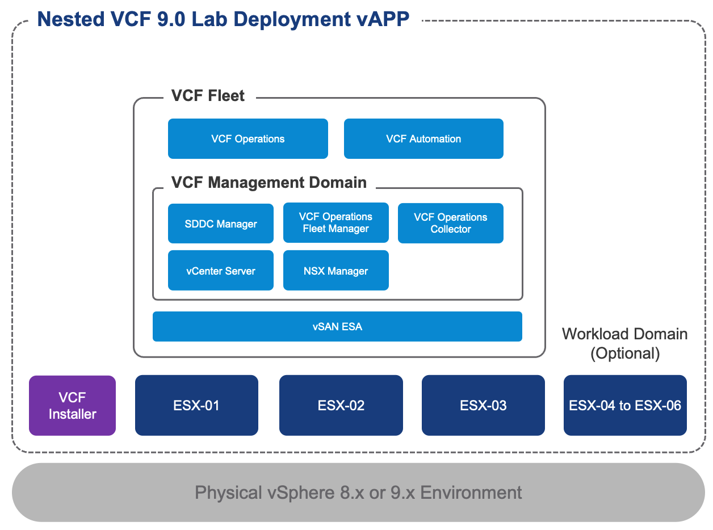
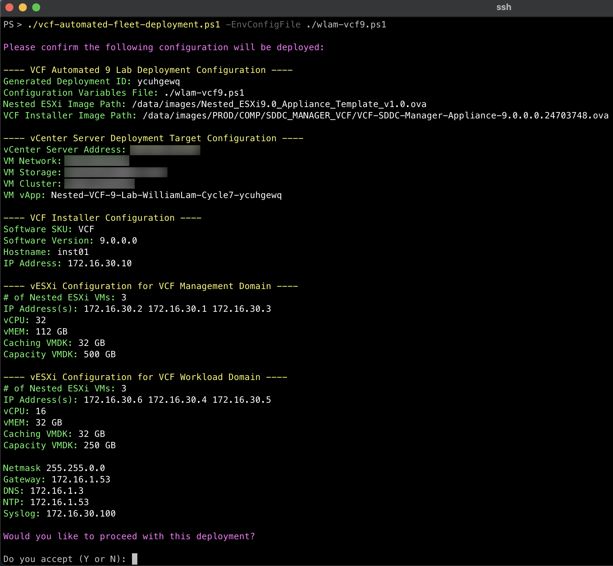
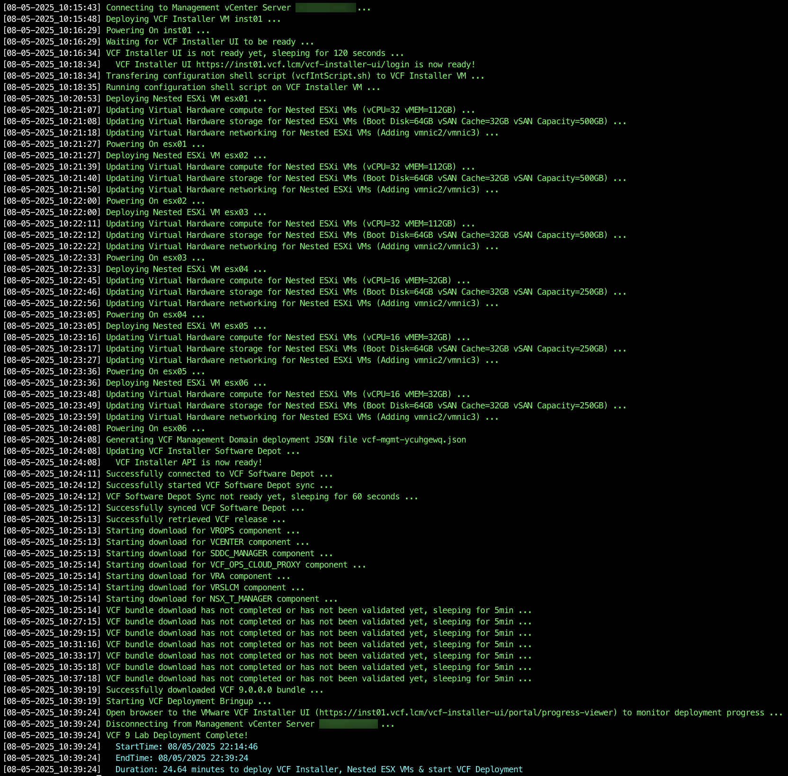
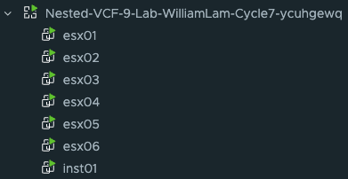
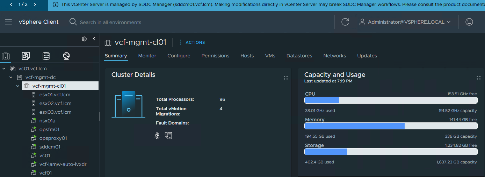
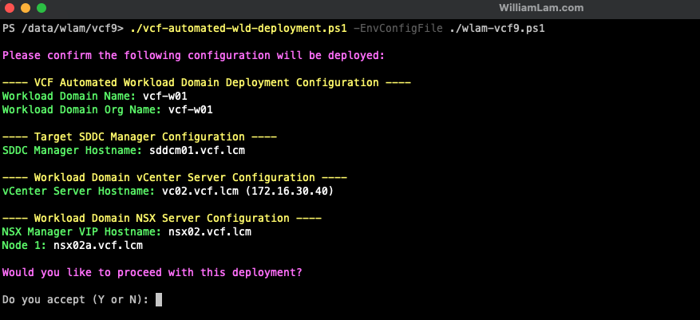
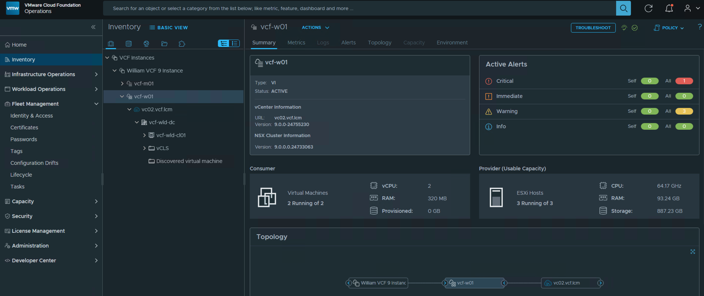

# Automated VMware Cloud Foundation Lab (VCF) 9.x Fleet Deployment

## Table of Contents

* [Description](#description)
* [Changelog](#changelog)
* [Requirements](#requirements)
* [Management Domain Configuration](#management-domain-configuration)
* [Workload Domain Configuration](#workload-domain-configuration)
* [Logging](#logging)
* [Sample Execution](#sample-execution)
    * [Deploy Nested ESX and VCF Installer VMs](#deploy-nested-esx-and-vcf-installer-vms)
    * [Deploy VCF Fleet with Management Domain](#deploy-vcf-fleet-with-management-domain)
    * [Deploy VCF Workload Domain](#deploy-vcf-workload-domain)

## Description

This script makes it very easy for anyone to deploy a "basic" VMware Cloud Foundation (VCF) 9.x Fleet in a Nested Lab environment for learning and educational purposes.

Below is a diagram of what is deployed as part of the solution and you will need to have an existing vSphere 8.x or 9.x environment running that is managed by vCenter Server and with enough resources (CPU, Memory and Storage) to deploy this "Nested" lab.



You are now ready to get your VCF on! 😁

## Changelog
* **09/01/2021**
  * Initial Release

## Requirements

* VCF subscription entitlement to download VCF 9.x software binaries
* VCF Online or Offline Depot
* [Nested ESX 9.0.0.0 OVA](https://support.broadcom.com/group/ecx/productfiles?subFamily=Flings&displayGroup=Nested%20ESXi%20Virtual%20Appliance&release=9.0.0.0&os=&servicePk=&language=EN)
    * ESXi 9.0 is only available as part of VMware Cloud Foundation (VCF) or VMware vSphere Foundation (VVF) subscription, you will need an active VVF/VCF entitlement to download the Nested ESXi 9.x Virtual Appliance. For [VMUG Advantage members who have obtained the new VCP-VCF certification](https://williamlam.com/2025/07/how-to-deploy-vvf-vcf-9-0-using-vmug-advantage-vcp-vcf-certification-entitlement.html), you will be entitled to the download.
* vCenter Server running at least vSphere 8.0 or later
    * If your physical storage is vSAN, please ensure you've applied the following setting as mentioned [here](https://www.williamlam.com/2013/11/how-to-run-nested-esxi-on-top-of-vsan.html)
* ESXi Networking
  * Enable either [MAC Learning](https://williamlam.com/2018/04/native-mac-learning-in-vsphere-6-7-removes-the-need-for-promiscuous-mode-for-nested-esxi.html) or [Promiscuous Mode](https://knowledge.broadcom.com/external/article?legacyId=1004099) and also enable Forged transmits on your physical ESXi host networking to ensure proper network connectivity for Nested ESXi workloads
* Resource Requirements
    * Compute
        * Ability to provision VMs with up to 24 vCPU
        * Ability to provision up to 336 GB of memory
        * DRS-enabled Cluster (not required but vApp creation will not be possible)
    * Network
        * 1 x Standard or Distributed Portgroup (routable) to deploy all VMs
           * 12 x FQDN/IP Addresses for initial VCF 9 Fleet
           * 6 x FQDN/IP Addresses for Workload Domain Deployment
    * Storage
        * Ability to provision up to 1.25 TB of storage (thin provisioned)
* Desktop (Windows, Mac or Linux) with latest PowerShell Core and PowerCLI 13 Core or later installed. See [instructions here](https://developer.broadcom.com/powercli/installation-guide) for more details

## Management Domain Configuration

Before deploying a VCF Fleet, which includes a VCF Management Domain, you will need to edit the deployment configuration file that contains all the relevant variables that are used by the deployment scripts.With the variables externalized from the deployment script, you can now have different configuration files for different environments or deployments, which are then passed to the deployment script.

See [sample-william-vcf.ps1](sample-william-vcf.ps1) for an example

This section describes the credentials to your physical vCenter Server in which the VCF lab environment will be deployed to:
```console
$VIServer = "FILL_ME_IN"
$VIUsername = "FILL_ME_IN"
$VIPassword = "FILL_ME_IN"
```

This section describes the general configuration and networking settings that will be applied to both VCF Installer and Nested ESXi VMs on your physical vCenter Server environment.
```console
$VAppLabel = "WilliamLam-VCF9"
$VMDatacenter = "Datacenter"
$VMCluster = "MyCluster"
$VMNetwork = "MyNetwork"
$VMDatastore = "MyDatastore"
$VMNetmask = "255.255.0.0"
$VMGateway = "172.16.1.53"
$VMDNS = "172.16.1.3"
$VMNTP = "172.16.1.53"
$VMPassword = "VMware1!"
$VMDomain = "vcf.lab"
$VMSyslog = "172.16.1.250"
$VMFolder = "wlam"
```

This section describes enabling debug option which will produce additional logging of the API request and pyaload for troubleshooting purposes.
```console
$Debug = $false
```

This section describes the location of the files required for deployment.
```console
$NestedESXiApplianceOVA = "/images/Nested_ESXi9.0_Appliance_Template_v1.0.ova"
$VCFInstallerOVA = "/images/VCF-SDDC-Manager-Appliance-9.0.0.0.24703748.ova"
```

This section describes the VCF version to deploy
```console
$VCFInstallerProductVersion = "9.0.0.0"
$VCFInstallerProductSKU = "VCF"
```

This section describes the VCF Offline Depot configuration which supports both Offline and Online.

For VCF Online Depot, generate [Broadcom Download Token](https://knowledge.broadcom.com/external/article/390098) and update `$VCFInstallerDepotToken` variable with the value and change `$VCFInstallerSoftwareDepot` to `online`

For VCF Offline Depot, you will need to have all required binaries/metadata downloaded using the new [VCF Download Tool](https://techdocs.broadcom.com/us/en/vmware-cis/vcf/vcf-9-0-and-later/9-0/deployment/deploying-a-new-vmware-cloud-foundation-or-vmware-vsphere-foundation-private-cloud-/preparing-your-environment/downloading-binaries-to-the-vcf-installer-appliance/use-the-vmware-download-tool-to-download-binaries.html). If you are a VMUG Advantage Member with VCP-VCF certification, you can refer to this [process](https://williamlam.com/2025/07/how-to-deploy-vvf-vcf-9-0-using-vmug-advantage-vcp-vcf-certification-entitlement.html) for setting up your VCF Offline Depot. Once your VCF Offline Depot is up and running, you can then populate the required fields below.

For VCF Offline Depot, this must be setup in advanced
```console
# VCF Software Depot Configuration
$VCFInstallerSoftwareDepot = "offline" #online or offline
$VCFInstallerDepotToken = ""

# Offline Depot Configurations (optional)
$VCFInstallerDepotUsername = "vcf"
$VCFInstallerDepotPassword = "vcf123!"
$VCFInstallerDepotHost = "172.16.1.54"
$VCFInstallerDepotPort = 8888
$VCFInstallerDepotHttps = $false
```

This section describes the VCF Fleet level configuration values. The `$DeploymentInstanceName` can be a friendly label that is displayed within VCF Operations but the `$DeploymentId` should be DNS-compliant, no special characters or spaces.
```console
$DeploymentInstanceName = "William VCF 9 Instance"
$DeploymentId = "vcf-m01"
$CEIPEnabled = $true
$FIPSEnabled = $true
```

This section describes the VCF Installer configuration which will be deployed onto your physical vCenter Server environment, along side the Nested ESXi VMs. The `$VCFInstallerAdminUsername` value should be left as the default below.
```console
$VCFInstallerVMName = "inst01"
$VCFInstallerFQDN = "inst01.vcf.lab"
$VCFInstallerIP = "172.16.30.10"
$VCFInstallerAdminUsername = "admin@local"
$VCFInstallerAdminPassword = "VMware1!VMware1!"
$VCFInstallerRootPassword = "VMware1!VMware1!"
```

This section describes the SDDC Manager component that will be deployed as part of the VCF Fleet.
```console
$SddcManagerHostname = "sddcm01"
$SddcManagerIP = "172.16.30.11"
$SddcManagerRootPassword = "VMware1!VMware1!"
$SddcManagerVcfPassword = "VMware1!VMware1!"
$SddcManagerSSHPassword = "VMware1!VMware1!"
$SddcManagerLocalPassword = "VMware1!VMware1!"
```

This section defines the number of Nested ESXi VMs to deploy along with their associated IP Address(s). The names are the display name of the VMs when deployed and you should ensure these are added to your DNS infrastructure. A minimum of three hosts is required for VCF deployment.
```console
$NestedESXiHostnameToIPsForManagementDomain = @{
    "esx01"   = "172.16.30.1"
    "esx02"   = "172.16.30.2"
    "esx03"   = "172.16.30.3"
}
```

This section defines the number of Nested ESXi VMs to deploy along with their associated IP Address(s) for use in a Workload Domain deployment. The names are the display name of the VMs when deployed and you should ensure these are added to your DNS infrastructure. A minimum of three hosts should be used for Workload Domain deployment
```console
$NestedESXiHostnameToIPsForWorkloadDomain = @{
    "esx04"   = "172.16.30.4"
    "esx05"   = "172.16.30.5"
    "esx06"   = "172.16.30.6"
}
```

This section describes the amount of resources to allocate to either the Nested ESXi VM(s) for use with Management Domain as well as Workload Domain (if you choose to deploy.) Depending on your usage, you may want to increase the resources but for proper functionality, this is the minimum to start with. For Memory and Disk configuration, the unit is in GB.

```console
# Nested ESXi VM Resources for Management Domain
$NestedESXiMGMTvCPU = "32"
$NestedESXiMGMTvMEM = "112" #GB
$NestedESXiMGMTCachingvDisk = "32" #GB
$NestedESXiMGMTCapacityvDisk = "500" #GB
$NestedESXiMGMTBootDisk = "64" #GB

# Nested ESXi VM Resources for Workload Domain
$NestedESXiWLDvCPU = "16"
$NestedESXiWLDvMEM = "32" #GB
$NestedESXiWLDCachingvDisk = "32" #GB
$NestedESXiWLDCapacityvDisk = "250" #GB
$NestedESXiWLDBootDisk = "64" #GB
```

This section describes the Nested ESXi Networks that will be used for VCF configuration. For the ESXi management network, the CIDR definition should match the network specified in `$VMNetwork` variable.
```console
$NestedESXiManagementNetworkCidr = "172.16.0.0/16" # should match $VMNetwork configuration
$NestedESXivMotionNetworkCidr = "10.1.32.0/24"
$NestedESXivSANNetworkCidr = "10.1.33.0/24"
$NestedESXiNSXTepNetworkCidr = "10.1.34.0/24"
```

This section describes the vCenter Server configuration that will be used within the VCF Fleet deployment.
```console
$VCSAName = "vc01"
$VCSAIP = "172.16.30.13"
$VCSARootPassword = "VMware1!VMware1!"
$VCSASSOPassword = "VMware1!VMware1!"
$VCSASize = "small"
$VCSAEnableVCLM = $true
$VCSADatacenterName = "vcf-mgmt-dc"
$VCSAClusterName = "vcf-mgmt-cl01"
```

This section describes the vSAN configurations that will be used within the VCF Fleet deployment.
```console
$VSANFTT = 0
$VSANDedupe = $false
$VSANESAEnabled = $false
$VSANDatastoreName = "vsanDatastore"
```

This section describes the VCF Operation configurations that will be used within the VCF Fleet deployment.
```console
$VCFOperationsSize = "small"
$VCFOperationsHostname = "vcf01"
$VCFOperationsIP = "172.16.30.12"
$VCFOperationsRootPassword = "VMware1!VMware1!"
$VCFOperationsAdminPassword = "VMware1!VMware1!"
```

This section describes the NSX Manager configurations that will be used within the VCF Fleet deployment.
```console
$NSXManagerSize = "medium"
$NSXManagerVIPHostname = "nsx01"
$NSXManagerVIPIP = "172.16.30.14"
$NSXManagerNodeHostname = "nsx01a"
$NSXRootPassword = "VMware1!VMware1!"
$NSXAdminPassword = "VMware1!VMware1!"
$NSXAuditPassword = "VMware1!VMware1!"
```

This section describes the VCF Operations Collector configurations that will be used within the VCF Fleet deployment.
```console
$VCFOperationsCollectorSize = "small"
$VCFOperationsCollectorHostname = "opsproxy01"
$VCFOperationsCollectorRootPassword = "VMware1!VMware1!"
```

This section describes the VCF Operations Fleet Manager configurations that will be used within the VCF Fleet deployment.
```console
$VCFOperationsFleetManagerHostname = "opsfm01"
$VCFOperationsFleetManagerAdminPassword = "VMware1!VMware1!"
$VCFOperationsFleetManagerRootPassword = "VMware1!VMware1!"
```

This section describes the VCF Automation configurations that will be used within the VCF Fleet deployment.
```console
$VCFAutomationHostname = "auto01"
$VCFAutomationAdminPassword = "VMware1!VMware1!"
$VCFAutomationIPPool = @("172.16.30.23","172.16.30.24")
$VCFAutomationNodePrefix = "vcf-lamw-auto"
$VCFAutomationClusterCIDR = "198.18.0.0/15"
```

This section describes the Workload Domain configurations, this is completely optional and is only processed when running the `vcf-automated-wld-deployment.ps` script is used.
```console
$VCFWorkloadDomainName = "vcf-w01"
$VCFWorkloadDomainOrgName = "vcf-w01"
$VCFWorkloadDomainEnableVCLM = $true
$VCFWorkloadDomainEnableVSANESA = $false
```

This section describes the vCenter Server configurations for the Workload Domain
```console
$VCFWorkloadDomainVCSAHostname = "vc02"
$VCFWorkloadDomainVCSAIP = "172.16.30.40"
$VCFWorkloadDomainVCSARootPassword = "VMware1!VMware1!"
$VCFWorkloadDomainVCSASSOPassword = "VMware1!VMware1!"
$VCFWorkloadDomainVCSADatacenterName = "vcf-wld-dc"
$VCFWorkloadDomainVCSAClusterName = "vcf-wld-cl01"
```

This section describes the NSX Manager configurations for the Workload Domain
```console
$VCFWorkloadDomainNSXManagerVIPHostname = "nsx02"
$VCFWorkloadDomainNSXManagerNode1Hostname = "nsx02a"
$VCFWorkloadDomainNSXManagerNode1IP = "172.16.30.42"
$VCFWorkloadDomainNSXAdminPassword = "VMware1!VMware1!"
$VCFWorkloadDomainSeparateNSXSwitch = $false
```


## Logging

There is additional verbose logging that outputs as a log file in your current working directory **vcf-9-lab-deployment-XXX.log**

## Sample Execution

In the example below, I am using /16 VLAN (172.16.0.0/16) for all my management VMs with the following DNS entries:

|           FQDN          | IP Address    | Function                |
|:-----------------------:|---------------|-------------------------|
| esx01.vcf.lab       | 172.16.30.1  | ESX Host 1 for Mgmt          |
| esx02.vcf.lab       | 172.16.30.2  | ESX Host 2 for Mgmt          |
| esx03.vcf.lab       | 172.16.30.3  | ESX Host 3 for Mgmt          |
| esx04.vcf.lab       | 172.16.30.4  | ESX Host 1 for WLD           |
| esx05.vcf.lab       | 172.16.30.5  | ESX Host 2 for WLD           |
| esx06.vcf.lab       | 172.16.30.6  | ESX Host 3 for WLD           |
| inst01.vcf.lab      | 172.16.30.10 | VCF Installer                |
| sddcm01.vcf.lab     | 172.16.30.11 | SDDC Manager                 |
| vcf01.vcf.lab       | 172.16.30.12 | VCF Operations               |
| vc01.vcf.lab        | 172.16.30.13 | vCenter Server for Mgmt      |
| nsx01.vcf.lab       | 172.16.30.14 | NSX Manager VIP for Mgmt     |
| nsx01a.vcf.lab      | 172.16.30.15 | NSX Manager Node 1 for Mgmt  |
| opsproxy01.vcf.lab  | 172.16.30.20 | VCF Operations Collector     |
| opsfm01.vcf.lab     | 172.16.30.21 | VCF Operations Fleet Manager |
| auto01.vcf.lab      | 172.16.30.22 | VCF Automation               |

### Deploy Nested ESX and VCF Installer VMs

Here is a screenshot of running the script if all basic pre-reqs have been met and the confirmation message before starting the deployment:



Here is an example output of a complete deployment:



💡 Deployment time will vary based on underlying physical infrastructure resources. In my lab, this took ~19min to complete.

Once completed, you will end up with the following VMs placed into a vApp.



### Deploy VCF Fleet with Management Domain

By default, the script will auto generate the required VCF Fleet with Management Domain deployment file `vcf-mgmt-XXX.json` based on your input and save that into the current working directory. Additionally, the VCF deployment file will automatically be submitted to the VCF Installer to begin the VCF deployment and you can monitor the progress by logging into the VCF Installer UI.

💡 If you wish to disable and/or customize the `vcf-mgmt-XXX.json` spec prior to submitting, you can disable the automatic deployment process by searching for the variable named `$startVCFBringup` in the script and updating the value to 0.

The deployment can take up to several hours to complete depending on your underlying physical resources. Once completed, you should see the following screen confirming the deployment finished and you can now login to your new VCF 9.0 environment!


When logging into the vCenter Server for the VCF Management Domain, you should see the following in the vSphere Inventory:



### Deploy VCF Workload Domain

A supplemental automation script [vcf-automated-wld-deployment.ps1](vcf-automated-wld-deployment.ps1) can be used to automatically standup a VCF workload domain. It will assume that the VCF Workload Domain host commission file `vcf-commission-host-api.json` was automatically generated from running the initial deployment script and this file will contain a "TBD" field because the VCF Installer API expects the Management Domain Network Pool ID, which will be retrieved automatically as part of using the additional automation.

Here is an example of what will be deployed as part of Workload Domain creation:

|           FQDN          | IP Address    | Function                    |
|:-----------------------:|---------------|-----------------------------|
| vc02.vcf.lab            | 172.16.30.40 | vCenter Server for WLD       |
| nsx02.vcf.lab           | 172.16.30.41 | NSX Manager VIP for WLD      |
| nsx02a.vcf.lab          | 172.16.30.42 | NSX Manager Node 1 for WLD   |

### Example Deployment

Here is a screenshot of running the script, which you will provide the same environment configuration file as the initial VCF Fleet deployment.



As part of deploying the VCF Workload Domain, it will ensure the SDDC Manager is connected to either your VCF Online or Offline Depot and synchronize binaries before deployment can begin. This can take some time depending on your depot method and connectivity.


Once the VCF Workload Domain deployment has begun, you can login to either vCenter Server or VCF Operations to monitor the progress of the deployment.

💡 The deployment progress not show up immediately, so give it some time and once the deployment has successfully completed, you should now see a new VCF Workload Domain connected to your existing VCF Fleet

